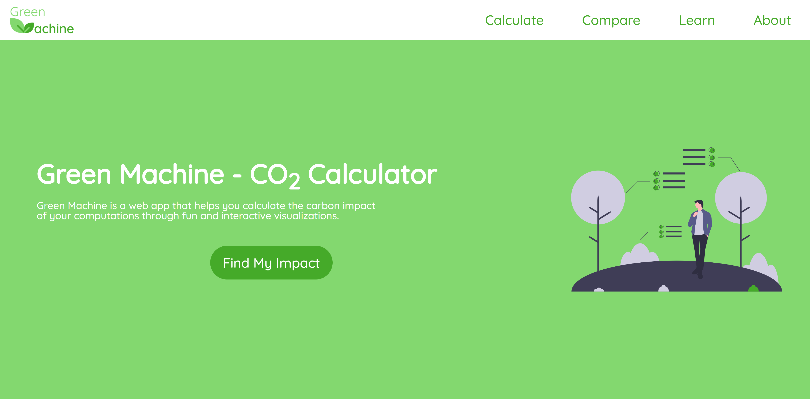
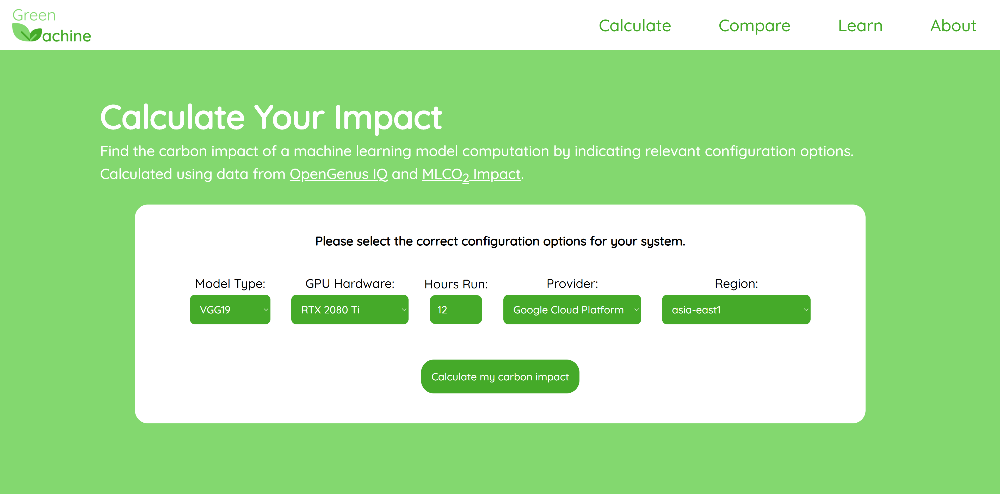
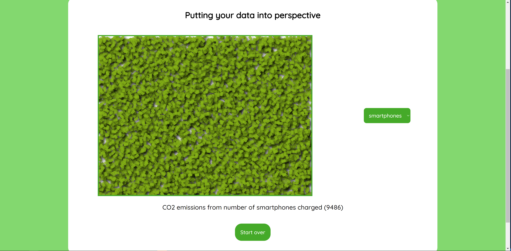

# Green Machine

Green Machine is a web app that helps you calculate the carbon impact of your computations through fun and interactive visualizations.

The project is built with React, styled-components, and uses data from [TOP500](https://www.top500.org/), [EPA](https://www.epa.gov/energy/greenhouse-gas-equivalencies-calculator), [MLCO2](https://github.com/mlco2/impact/tree/master/data), and [OpenGenus IQ](https://iq.opengenus.org/floating-point-operations-per-second-flops-of-machine-learning-models/).

### Features

- Calculate the carbon emissions from your high performance computing services, get insights on how to reduce your carbon impact, and see the data in interactive visualizations.
- Compare the energy efficiency of leading supercomputers such as MIT's Satori with other systems including your own.
- ...

## Usage

Run `npm install` and `npm start` to launch the app locally. `npm run build` to build a production ready copy.

Visit [https://green-compute-challenge.web.app/compare](https://green-compute-challenge.web.app/compare) for a live demo of this project.